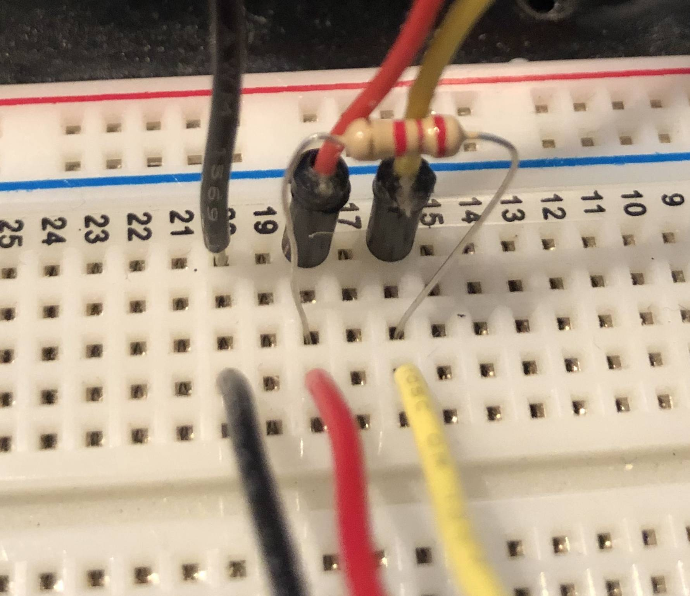

arduino-brouwkuyp-control
=========================

Brouwkuyp brewery control software
Arduino part

## Hardware
### Infrastructure
- AMQP Broker (RabbitMQ (3.8.9))
  - Running on port `1883` with a fixed IP of `192.68.10.10`
- Arduino (Uno)
  - Running on fixed IP `192.168.10.20`
- Temperature sensors (DB18S20)

### Sensors
Temperatuursensor Hygrosens Temperatuursensor M10, kabel 2 m. -55 tot 125 °C. Soort behuizing Roestvrijstalen sensorbuis. 
Bought via Conrad, not available anymore. Alternatively we could try to have one of the following sensors, when needed.
- [Emko RTR Temperatuursensor Pt100](https://www.conrad.nl/p/emko-rtr-temperatuursensor-sensortype-pt100-meetbereik-temperatuur-50-tot-400-c-sensor-8-mm-2267364)


### Electrical schema


- Put **5V**, **Ground** and **Control Wire (PIN 2)** on bread board (left side).
- Align your **5V**, **Ground** and **Control Wire (PIN 2)** of the Temperature Sensor directly (on right side).
- Put the **2.2K** resistor between the **5V** and **Control Wire (PIN 2)** of Arduino and Sensor
  - Place the resistor closest to the Arduino, because you only need one resistor when you're using multiple sensors.
- Put one end of the resistor on the **5V** and the other end in the **Control Wire (PIN 2)**.

It's necessary to use a **2.2K** resistor since all other tutorials refer to a *4.7K* resistor, which doesn't work.

## Software
### Code

After installing the [Arduino IDE](https://www.arduino.cc/en/software), git clone this project in the `/Users/<current_user>/Documents/Arduino` folder.
When you open the project make sure that the port to connect the Arduino with your development PC is set correctly.
Double check via `Tools > Port: ...`, it should say something like `/dev/cu.usbmodem1412101 (Arduino Uno)`. If there are
multiple `usbmodem` ports, select the one with `Arduino Uno` in it.

Once setup correctly, you are able to verify and upload the code to the Arduino (Uno) (via the Arduino IDE).

For debugging purposes you have also access to the Serial Monitor (cmd + shift + M), via `println` statements in the code
you may write to this log.

#### Libraries
The following libraries are need to be installed (via `Tools > Manage libraries...`:
- **DallasTemperature** (v3.9.0) [sensors]
  - **OneWire** (v2.3.5)
- **elapsedMillis** (v1.0.6) [timing]
- **PubSubClient** (v2.8.0) [AMQT messages]
- **ArduinoJson** (v6.17.2) [convert data to json in event]

### Variables

The Arduino includes a `env.h`-file (to simulate a 'dotenv' like secrets config). The file needs to include the following data:
```c++
#define SECRET_MQTT_USER "<username>"
#define SECRET_MQTT_PASS "<password>"
```
